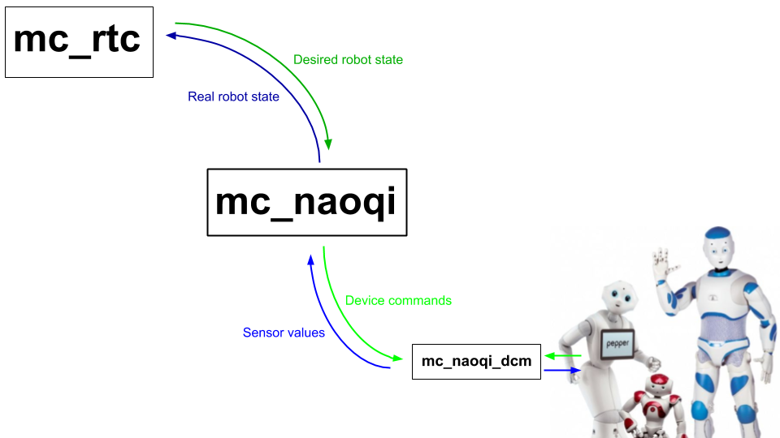

# **mc_naoqi**

### Interface to handle communication between [`mc_rtc`](https://jrl-umi3218.github.io/mc_rtc/) and SoftBank humanoid robots running NAOqi OS



### Author, Contact, BibTeX

Anastasia Bolotnikova (a.bolotnikova[at]softbankrobotics.com)

```
@unpublished{bolotnikova2021sii,
  title = {Task-Space Control Interface for SoftBank Humanoid Robots and its Human-Robot Interaction Applications},
  author = {Anastasia Bolotnikova and Pierre Gergondet and Arnaud Tanguy and S{\'e}bastien Courtois and Abderrahmane Kheddar},
  booktitle = {IEEE/SICE International Symposium on System Integration (SII 2021)},
  pdf = {https://hal.archives-ouvertes.fr/hal-02919367v3/document},
  url = {https://hal.archives-ouvertes.fr/hal-02919367},
  month = {January},
  year = {2021}
}
```

### Video presentation

[](https://www.youtube.com/watch?v=qzEnCGlT93s "Task-Space Control Interface for SoftBank Robots and its Human-Robot Interaction Applications")

# Installation

## On the control computer

Instead of using NAOqi SDK, the communication with naoqi OS is based on [naoqi_libqi](http://wiki.ros.org/naoqi_libqi) and [naoqi_libqicore](http://wiki.ros.org/naoqi_libqicore) ros packages:

```sh
sudo apt-get install ros-melodic-naoqi-libqi
sudo apt-get install ros-melodic-naoqi-libqicore
```

Then compile `mc_naoqi`.

``` bash
git clone https://github.com/jrl-umi3218/mc_naoqi.git
cd mc_naoqi
git submodule update --init
mkdir build
cd build
cmake ..
make
```

## On the robot

Communication with the robot sensors and actuators is managed using the embedded [DCM](http://doc.aldebaran.com/2-1/naoqi/sensors/dcm.html) module on the robot.
To access its features, [mc_naoqi_dcm](https://github.com/jrl-umi3218/mc_naoqi_dcm) needs to be installed and run on the robot.

# Usage

To use the interface and connect to a real robot run

```bash
# while in 'build' folder
./src/mc_naoqi -h <robot_hostname> -p <robot_port> -f <mc_rtc_configuration_file.conf>
```

If you wish to run the simulation only use `simulation` as a `<robot_hostname>`

```bash
# while in 'build' folder
./src/mc_naoqi -h simulation -f <mc_rtc_configuration_file.conf>
```

## CLI Commands

- `on` : servo on actuators
- `off` : servo off actuators
- `s` : starts `mc_rtc` controller if stopped, stops otherwise
- `hs` : go to half-sitting posture
- `cc <controller name>` : change controller

## ROS Services

If `mc_rtc` was compiled with ROS support, then services will be available to interact with controllers. You can see the list of all services available with

```sh
rosservice list /mc_rtc
```

# Supported robots

* **Pepper** (fully supported and tested)
* **NAO** (initial functionality implemented, to be tested)
* Romeo (not supported)

# Research works that used this interface

<details>
<summary>2020:
<a href="https://www.youtube.com/watch?v=vDmEc1aBODA">Human-robot interaction</a></summary>
<br>
@inproceedings{bolotnikova2020roman,
<br> &emsp;title = {Autonomous Initiation of Human Physical Assistance by a Humanoid},
<br> &emsp;author = {Anastasia Bolotnikova and S{\'e}bastien Courtois and Abderrahmane Kheddar},
<br> &emsp;booktitle = {IEEE International Conference on Robot and Human Interactive Communication},
<br> &emsp;address = {Naples, Italy},
<br> &emsp;month = {31 August--4 September},
<br> &emsp;year = {2020} <br>
}
</details>
<details>
<summary>2018: <a href="https://www.youtube.com/watch?v=NnVgbZqZebU">Compliant robot motion</a></summary>
<br>
@inproceedings{bolotnikova2018humanoids,
<br> &emsp;title={Compliant Robot Motion Regulated via Proprioceptive Sensor Based Contact Observer},
<br> &emsp;author={Anastasia Bolotnikova and S{\'e}bastien Courtois and Abderrahmane Kheddar},
<br> &emsp;booktitle={IEEE-RAS International Conference on Humanoid Robots},
<br> &emsp;pages={854--859},
<br> &emsp;address = {Beijing, China},
<br> &emsp;month = {6--9 November},
<br> &emsp;year={2018} <br>
}
</details>
<details>
<summary>2018: <a href="https://www.youtube.com/watch?v=nY9zMG0EsnM">Contact detection</a></summary>
<br>
@inproceedings{bolotnikova2018roman,
<br> &emsp;title = {Contact observer for humanoid robot Pepper based on tracking joint position discrepancies},
<br> &emsp;author = {Anastasia Bolotnikova and S{\'e}bastien Courtois and Abderrahmane Kheddar},
<br> &emsp;booktitle = {IEEE International Conference on Robot and Human Interactive Communication},
<br> &emsp;pages = {29--34},
<br> &emsp;address = {Nanjing, China},
<br> &emsp;month = {27--31 August},
<br> &emsp;year = {2018} <br>
}
</details>

# Acknowledgment

Thanks to [@gergondet](https://github.com/gergondet) and [@arntanguy](https://github.com/arntanguy) for developing and helping with this interface and the [`mc_rtc`](https://jrl-umi3218.github.io/mc_rtc/) framework
