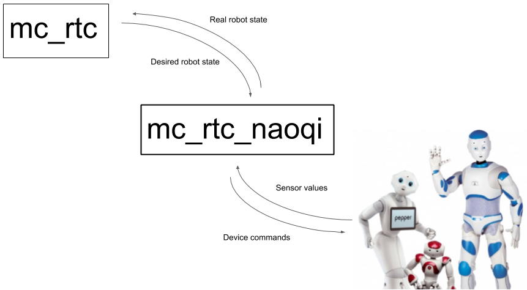

# mc_rtc_naoqi

### Interface to handle communication between `mc_rtc` and NAO/Pepper robots




# Installation

## On the control computer

Instead of using NAOqi SDK, the communication with naoqi OS is based on [naoqi_libqi](http://wiki.ros.org/naoqi_libqi) and [naoqi_libqicore](http://wiki.ros.org/naoqi_libqicore) ros packages:

```sh
sudo apt-get install ros-kinetic-naoqi-libqi
sudo apt-get install ros-kinetic-naoqi-libqicore
```

Then compile `mc_rtc_naoqi`.


## On the robot

Communication with the robot sensors and actuators is mananged using the embedded [DCM](http://doc.aldebaran.com/2-1/naoqi/sensors/dcm.html) module on the robot.
To access its features, [nao_fastgetsetdcm](https://gite.lirmm.fr/atanguy/nao_fastgetsetdcm) needs to be installed and run on the robot.

For PEPPER, see `topic/for_mc_rtc_naoqi_ros` in `nao_festgetsetdcm` repository (code needs to be updated to libqi use for NAO).

# Usage

```
mc_rtc_naoqi -h <robot_hostname> -p <robot_port> -f <mc_rtc_configuration_file.conf>
```

## CLI Commands

- `on` : servo on actuators
- `off` : servo off actuators
- `start` : starts `mc_rtc` controller
- `stop` : stops `mc_rtc` controller
- `hs` : go to half-sitting posture
- `cc <controller name>` : change controller

## ROS Services

If `mc_rtc` was compiled with ROS support, then services will be available to interact with controllers. You can see the list of all services available with

```sh
rosservice list /mc_rtc
```
